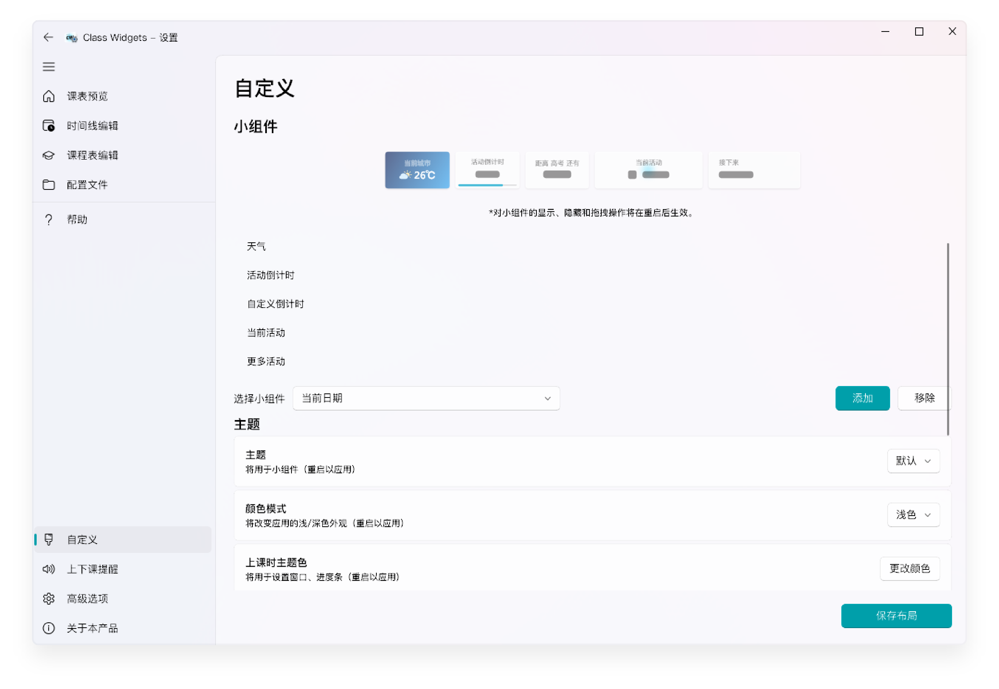

# 个性化

Class Widgets 支持多项自定义设置！您可以在此页面自由定义属于您的 Class Widgets。
## 主题 {#theme}
在 Class Widgets 中，您可以选择适合的主题。对于支持亮暗色的主题，将会在颜色模式切换时更换不同的风格。
详见[主题](theme)板块。

### 自定义倒计时 {#countdown}

Class Widgets 支持在小组件中添加自定义倒计时，可用于选择特定节日（如：中、高考等）。  
在“自定义”中“自定义倒计时”板块下填入节日日期和名称即可。
::: warning 注意
在使用“自定义倒计时”前，需添加这个小组件。
:::

## 天气 {#weather}

Class Widgets 可获取所设定地区的天气信息，并以小组件的形式展示。  
您可以在“自定义” -> “天气”板块下调整相关设置，详见[天气](weather-api)。
::: warning 注意
在使用“天气”前，需添加这个小组件。
:::