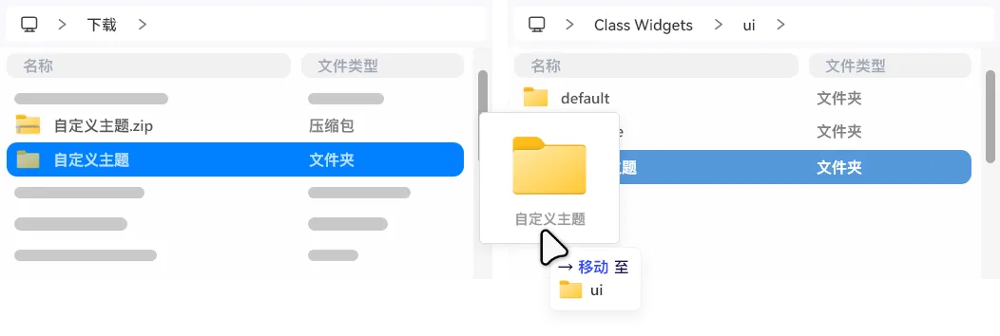

# 主题

在设置的“自定义”板块中，您可以找到如上的设置选项卡。
您可以通过“主题”选项卡快速切换您喜爱的主题；还可以通过“颜色模式”选项卡快速更改软件的外观。
::: tip 小尺寸主题
若要缩小小组件的大小，可在“主题”中选择“小尺寸”即可。
:::

::: warning 主题的深色模式
如果您导入的主题不支持深色模式，在切换到暗色模式时，小组件不会发生改变。
:::

## 第三方主题 {#3rd-party-theme}
目前，您可以通过导入第三方主题来美化 Class Widgets。

首先，先将下载到的第三方主题解压为独立的文件夹。然后将其移动到 Class Widgets 的“主题”文件夹（通常在 `./ui/`，也可以点击“打开‘主题’文件夹”），然后重新启动 Class Widgets 即可在“主题”选项卡中看到导入的第三方主题名称。  

如果您想制作第三方主题，请转到[开发文档](/dev/theme)。