# 天气 & API Key
在设置的“自定义”板块中，您可以找到如上的设置选项卡。
您可以通过“选择城市”选项卡选取您的地区以获得当地的天气数据；还可以在“设置天气源”选项卡更改软件使用的天气源。

::: info 关于 API Key
某些天气源需要设置 Key 才能正常使用。若无特殊情况，使用默认天气源即可。
:::
## 获取 API Key {#get-api-key}
若您因为某些需求不得不使用其他天气源，且此天气源需要 API Key，则请继续阅读。
### 和风天气 {#qweather}
1.进入网页  
首先，打开[和风天气开发服务](https://dev.qweather.com/)网页，然后点击“免费注册”按钮。

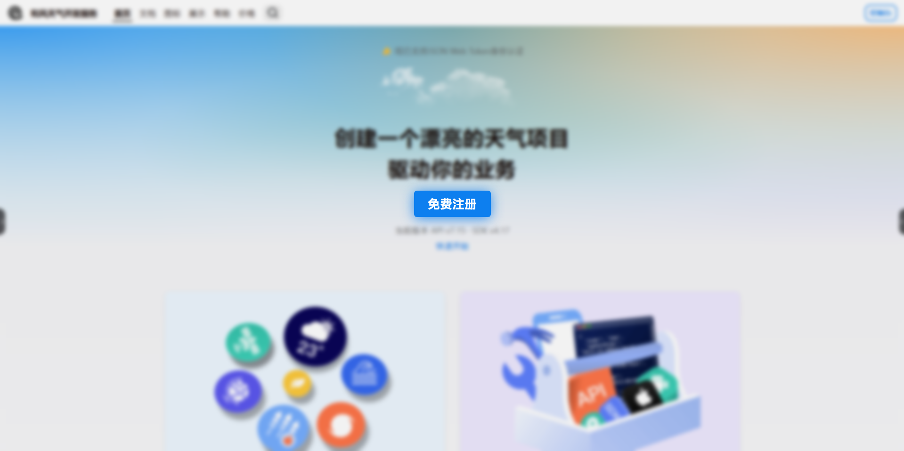

然后，注册您的“和风天气”账号并登录此账号。
2.打开“控制台”  

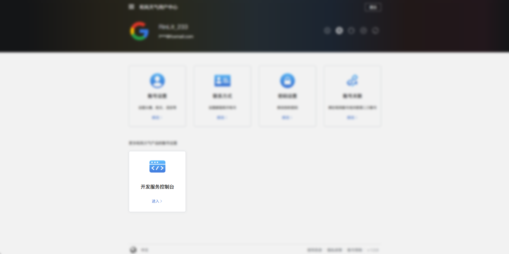

在进入用户中心后，点击“开发服务控制台”按钮进入控制台。在侧边栏中选中“项目管理”，然后点击“创建项目”按钮。

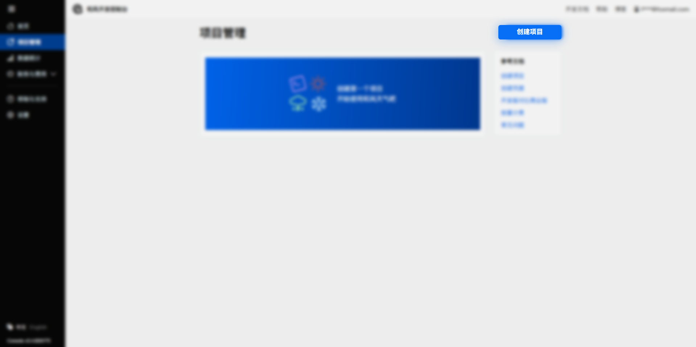

3.生成 API Key  
在“创建项目”页面中填入任意字段，并在“选择订阅”中选择免费订阅，即可创建。

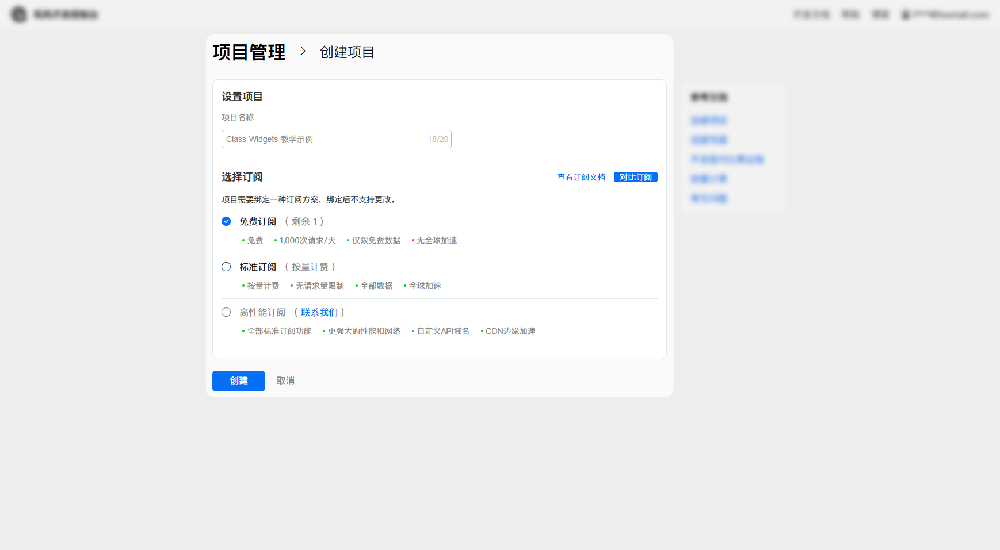

创建项目后，选择“创建凭据”，进入此界面。

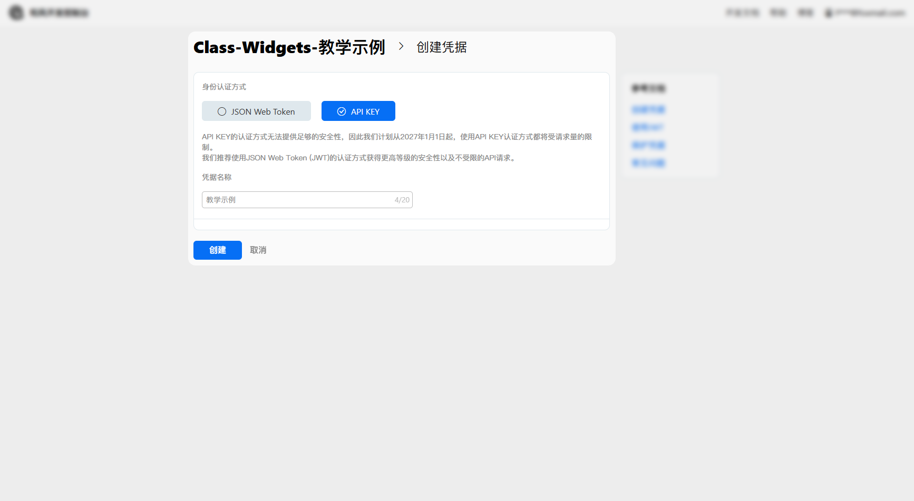

填入任意字段后，点击“创建”，就会进入完成页。
在完成页，将会显示已被创建的 API Key，接下来您仅需复制 API Key，并粘贴在天气设置选项卡的“设置 API Key”选项卡的文本框即可。

### 高德天气 {#amap}
1.进入[高德地图开放平台](https://dev.qweather.com/)，**登录**或**注册**账号。  
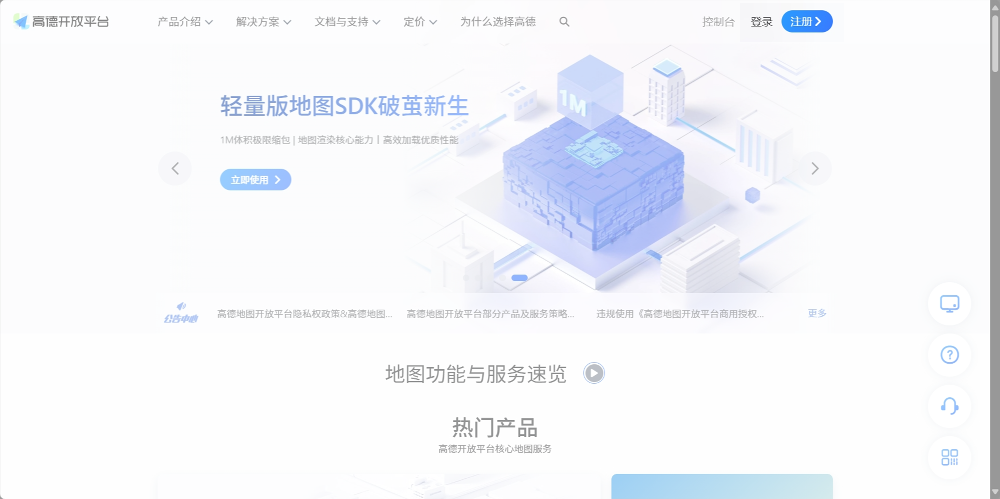

2.进入“**控制台**”。  

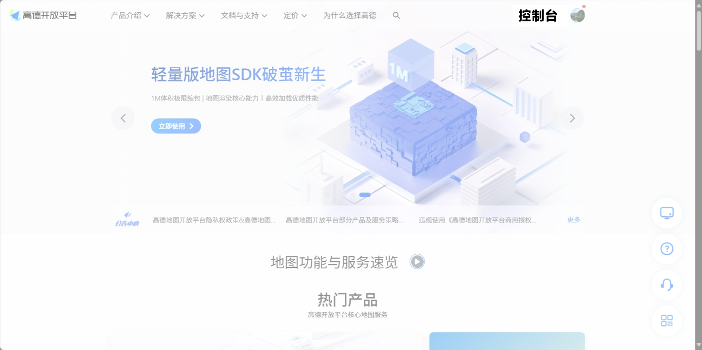

3.创建应用  
在 **“应用管理” -> “我的应用”** 选项卡中，选择“**创建新应用**”。

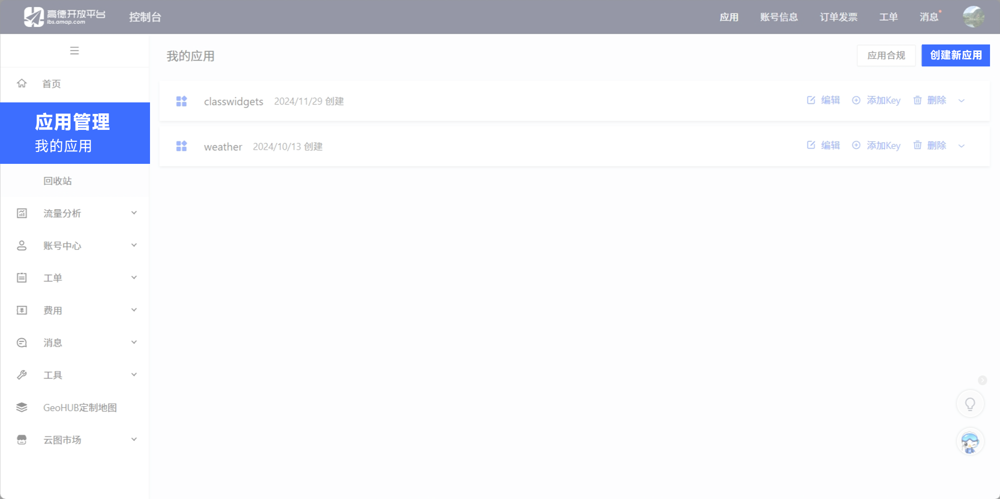

填写应用名称、应用类型，然后创建应用。  

4.创建 API Key  
接下来，在刚刚创建的应用中添加一个 Key。

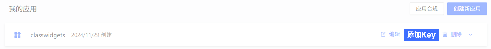
  
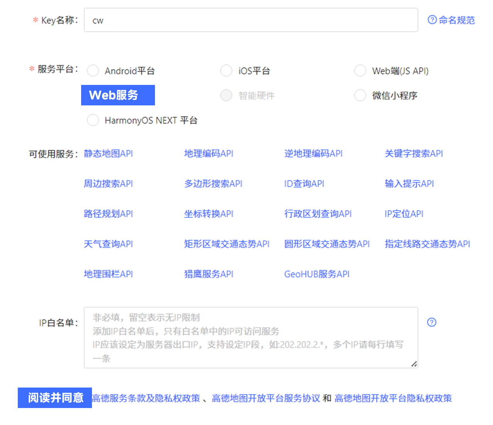

创建完成后，展开应用，您会看到您的 API Key：

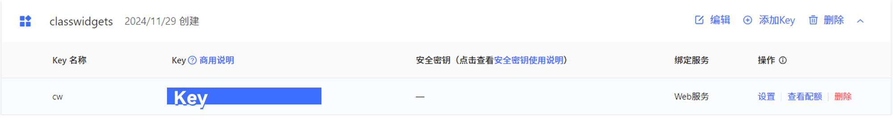

接下来，您只需复制 API Key，在 Class Widgets 中设置您的 Key。在重新选择城市之后，“天气”小组件将显示当前天气状态。