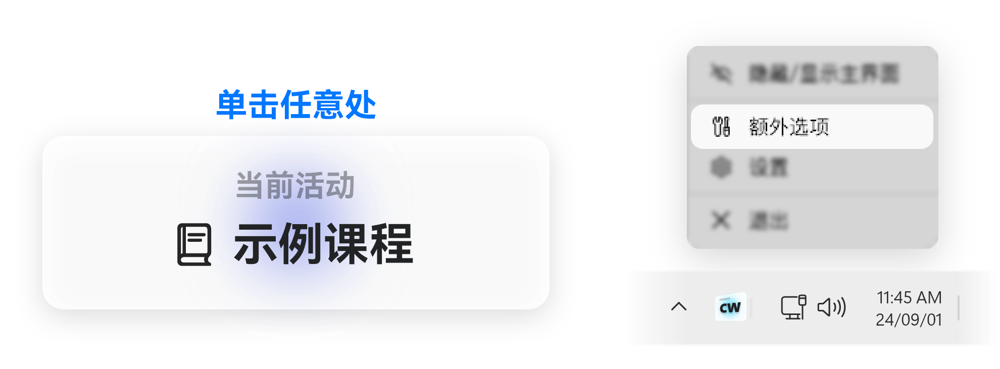
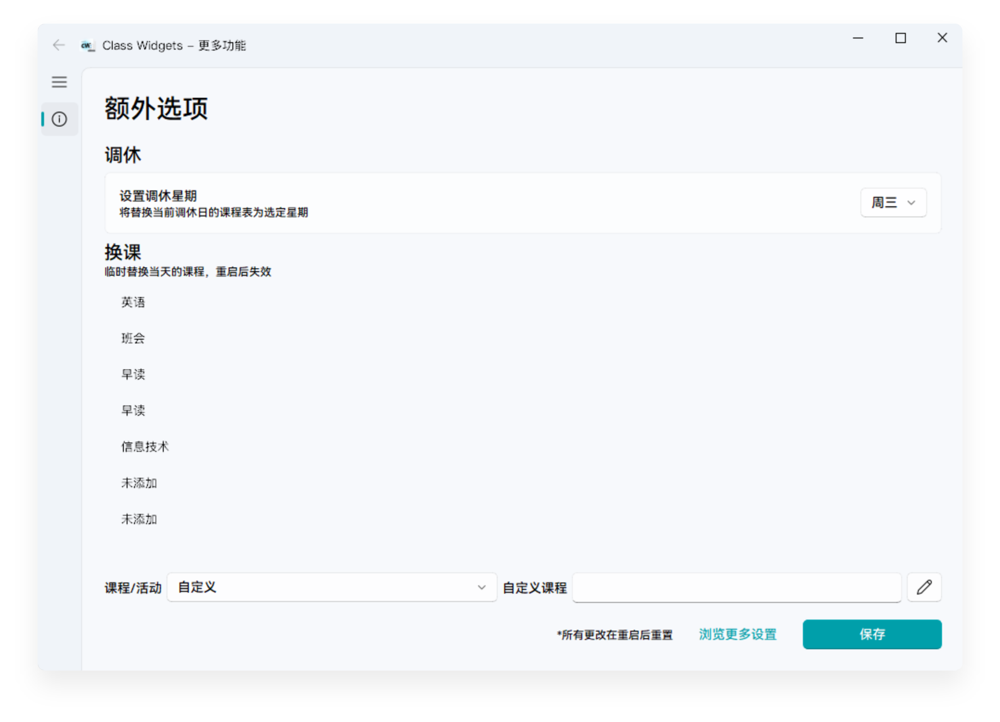
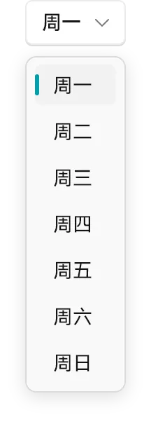

# 调休与换课
本文将为您介绍在课程计划有变时如何在 Class Widgets 中临时调整课程表。

在点击“**当前活动**”小组件或在托盘菜单点击“**额外选项**”后，您将见到此窗口。
::: warning 注意
自 v1.1.7-b4 起，快速打开“额外选项”窗口需要**右键**或**长按**“当前活动”小组件。
:::
在这个窗口，您可以调整当日课表内容及切换各个星期的课程表。

::: warning 更改时效性
在“额外选项”窗口中的“调休与换课”中的所有选项都会在 Class Widgets 重启后失效！  
若课程计划的变动是长期的，请在“设置”中更改。
:::

## 调休
当您遇到调休（即在被调休节假日补课）或其他情况需要上其他星期的课程，

您就可以打开“**额外选项**”窗口，点击“**设置调休星期**”选项卡右侧的下拉栏，选择您需要切换到的星期。**点击“保存”**后，Class Widgets 将会应用所设定星期的课表。

## 换课
当今日课程计划有所变化时，可在“**换课**”板块下编辑课程表。点击“保存”后，Class Widgets 将立即应用所设定的课程表。