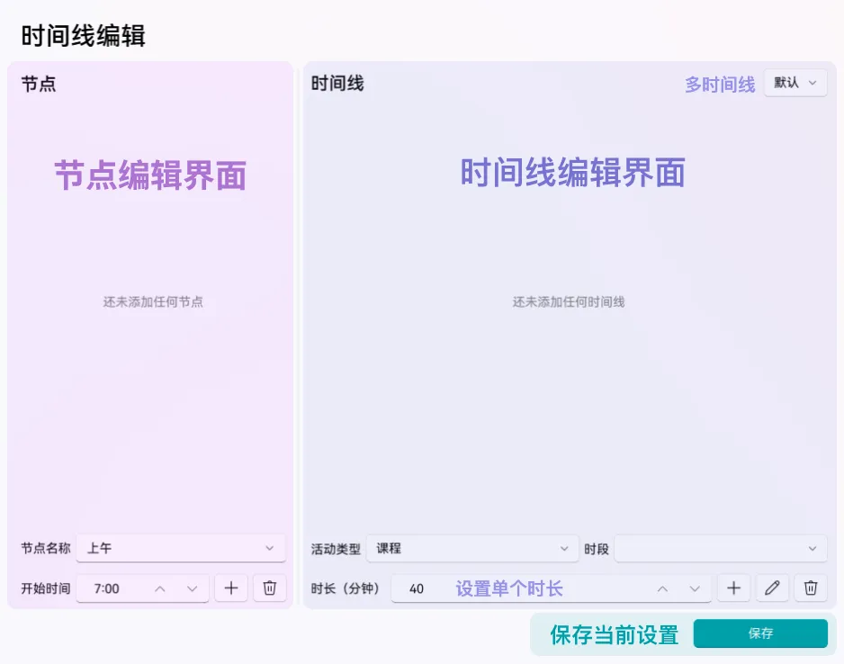
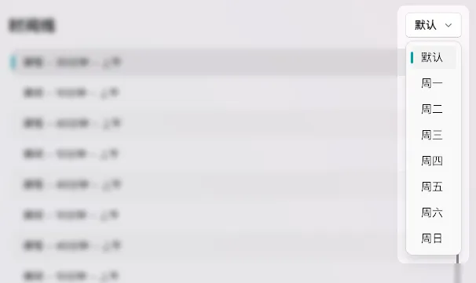

# 设置时间线
本文将为您介绍如何在 Class Widgets 中设置时间线。
## 介绍
时间线规定了在一天中各个节点和活动时长，如课程、课间等。Class Widgets 将根据时间线及当前时间显示课程表中对应的课程。

下面，请根据您使用的软件版本配置。
## v1.1.7 或更新版本 <Badge type="warning">beta</Badge> {#v117-or-newer}
::: danger 兼容性警告
只适用于 `v1.1.7` 或更新版本  
对于 `v1.1.6.5` 或更早版本，参见[这里](#v1165-or-older)
:::

  
设置界面分为上、下两个部分，在上面可以设置每个时段的“节点”（如：上午时段、下午时段和晚修），在下面可以分别为每个“节点”添加时间点（即活动类型，如：上课、课间、大课间等）。  
在每个编辑界面通常会配有三个操作按钮，分别对应“添加”、“编辑”及“删除”操作。可通过调整编辑页的选项以做出您希望的更改。
### 设置节点 {#v117-set-node}
接下来以该作息时间表举例。  

**示例时间表**

时间|活动类型
:-|:-
7:30-8:00|早读
8:10-8:50|第一节课
9:00-9:20|大课间
9:25-10:05|第二节课
10:15-10:55|第三节课
11:10-11:50|第四节课
午休|午休
14:40-15:20|第五节课
15:30-16:10|第六节课
16:25-17:05|第七节课
17:15-17:44|第八节课
18:00-18:40|课后服务

可以发现，一天中有两个时段：

时段|开始时间
:-|:-
上午|7:30
下午|14:40

接下来我们仅需将它们录入“节点”列表。  
对于一周内的多个时间线，请参考[多时间线](#multi-timeline)。

### 设置时间线 {#v117-set-timeline}
设置节点后，我们还需要录入时间线。  
根据示例时间表，我们可以知道：

活动类型|持续时长/分钟
-|-
课程（早读）|30
课间|10
课程|40（课程通常为 40 分钟）
课间|10
课程（大课间）|20
课间|5
课程|40
课间|10
课程|40
课间|15
...|...

将这些信息依次填入即可。  
对于一周内的多个时间线，请参考[多时间线](#multi-timeline)，并在“默认”时间线中填写常用的时间线。
### 多时间线 {#multi-timeline}
如果一周内有多个不同的时间线，则您可以使用多时间线配置。

首先，点击右上角的下拉框，选择您想要调整的星期即可。若您反悔，不希望改变当天时间线，只需把当日的所有时间点删除。

 

若当天节点安排不一致，添加一个新节点即可解决。
## v1.1.6.5 或更早版本<Badge type="info">stable</Badge> {#v1165-or-older}
::: info 有新版本
您可以升级到最新版本体验多时间线功能！见[安装](/guide/install)
:::
### 设置时段开始时间 {#v1165-set-node}
### 设置时间线 {#v1165-set-timeline}